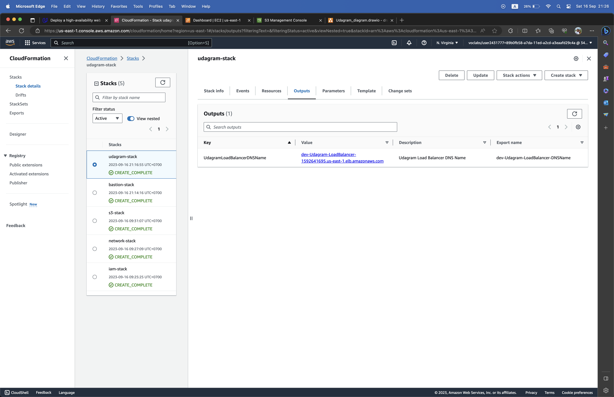
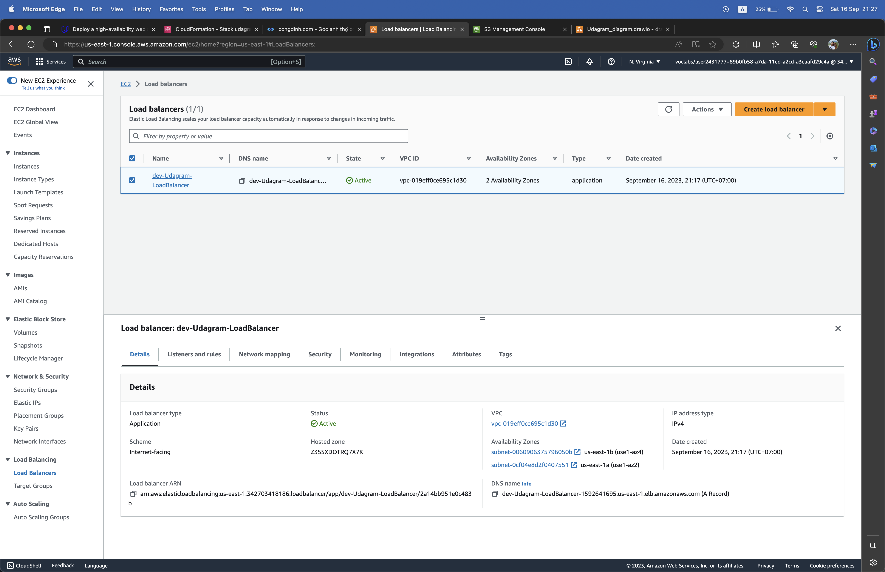
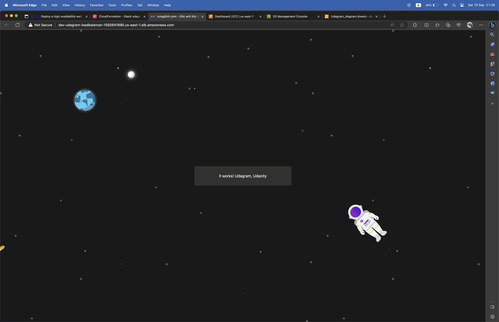
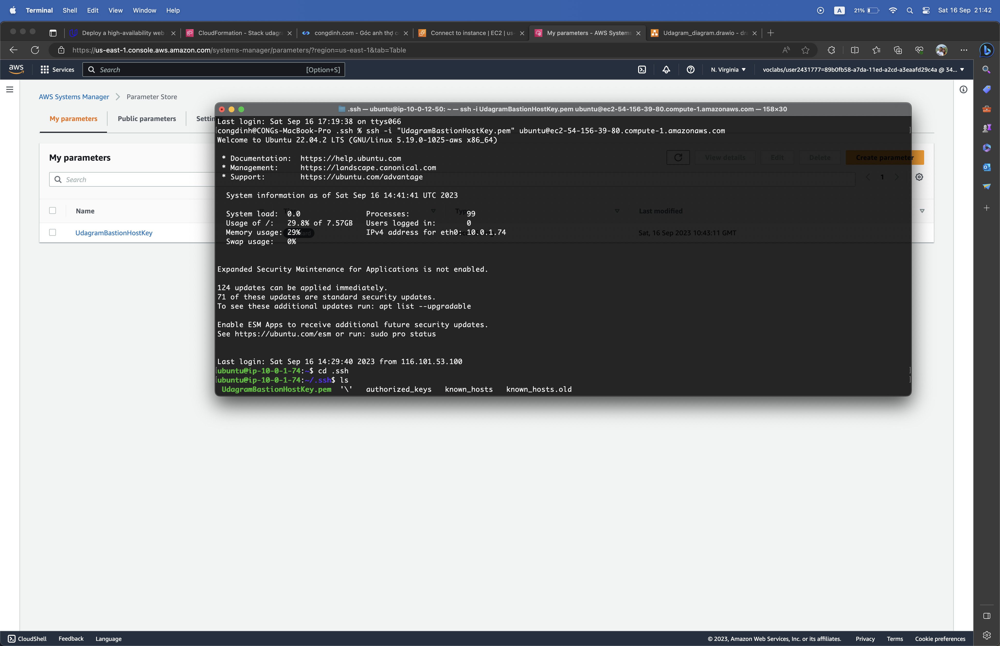
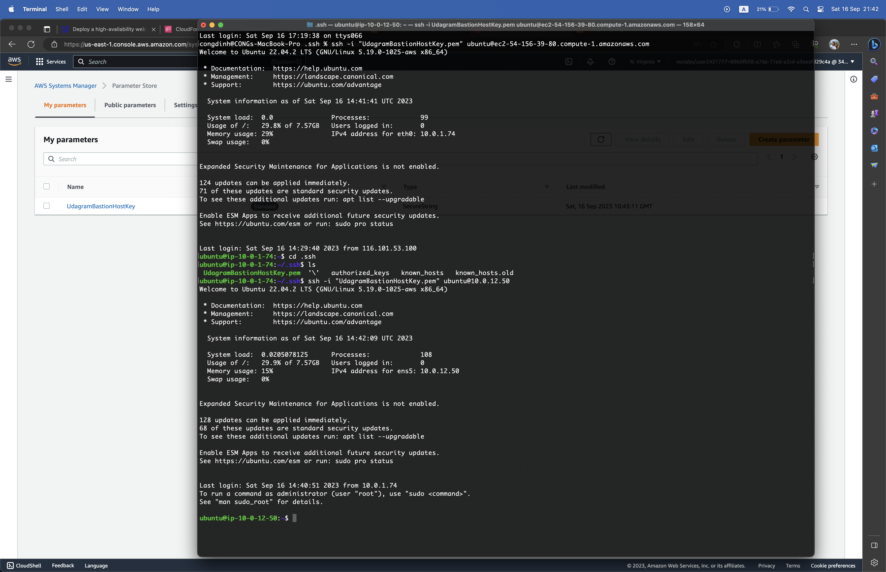

# Udacity AWS Cloud DevOps Engineer - Project 02 - Deploy a high-availability web app using CloudFormation

## Project Introduction

Creating this project will give you the hands-on experience you need to talk about infrastructure as code confidently. We have chosen a realistic scenario where you will deploy a dummy application (a sample JavaScript or HTML file) to an NGINX server running on an EC2 instance.

There will be two parts to this project:

- Diagram: You'll first develop a diagram that you can present as part of your portfolio and as a visual aid to understand the CloudFormation script.
- Script (Template and Parameters): The second part is to interpret the instructions and create a matching CloudFormation script.

## Project Scenario

Your company is creating an Instagram clone called Udagram, and the requirement is to deploy this new application to the AWS infrastructure using Infrastructure as Code.

You have been tasked with provisioning the required infrastructure and deploying a dummy application, along with the necessary supporting software.

Since the underlying network infrastructure will be maintained by a separate team, you must create independent stacks for the network infrastructure and the application itself.

Infrastructure spin up and tear down needs to be automated so that each team can create and discard testing environments on demand.


## Project Requirements

Each of these categories details the specific requirements for each component of the project. Complete the checklist at the bottom of the page to ensure your project is ready for submission.

### Infrastructure Diagram

1. You'll need to create an infrastructure diagram in a tool of your choice, with all the AWS resources you need for your solution. Resources we expect to see in the diagram:

   a. Network resources: VPC, subnets, Internet Gateway, NAT Gateways

   b. EC2 resources: Autoscaling group with EC2 instances, Load Balancer, Security Groups

   c. Static Content: S3 bucket.

2. Use arrows to include any relevant relations between resources.
3. Feel free to omit name labels for any resource icons you deem appropriate, as long as the diagram is still clear and unambiguous.

### Network and Servers Configuration

1. You can deploy to any region.
2. You'll need to create the networking infrastructure for your solution, including a new VPC and four subnets: two public and two private, following high availability best practices.
3. Use a parameters JSON file to pass CIDR blocks for your VPC and subnets.
4. You'll need to attach Internet and NAT gateways for internet access.
5. You'll need to use Launch Templates to create an Autoscaling Group for your application servers in order to deploy four servers, two located in each of your private subnets.
6. Your CPU and RAM requirements will be covered with t2.micro instances, so use this instance type. The Operating System to be used is Ubuntu 22.
7. The application must be exposed to the internet using an Application Load Balancer.

### Static Content

1. You'll need to create an S3 bucket with CloudFormation to store all static content. This bucket should have public-read access.
2. Your servers IAM Role should provide read and write permissions to this bucket.

### Security Groups

1. Udagram communicates on the default HTTP Port: 80, so your servers will need this inbound port open since you will use it with the Load Balancer and the Load Balancer Health Check. As for outbound, the servers will need unrestricted internet access to be able to download and update their software.
2. The load balancer should allow all public traffic (0.0.0.0/0) on port 80 inbound, which is the default HTTP port.

### CloudFormation Templates

1. Considering that a network team will be in charge of the networking resources, you'll need to deliver two separate templates: one for networking resources and another one for your application specific resources (servers, load balancer, bucket).
2. Your application template should use outputs from your networking template to identify the hosting VPC and subnets.
3. One of the output exports of the CloudFormation application stack should be the public URL of the LoadBalancer. Bonus points if you add `http://` in front of the load balancer DNS Name in the output, for convenience.
4. You should be able to create and destroy the entire infrastructure using scripts (no UI interactions). You can use any language you like (bash or python, for example), but you must be using the CloudFormation CLI or libraries built on top of it (boto3, for example).

### BONUS (Optional features)

1. Create a Cloudfront distribution to serve your static content.
2. Set up a bastion host (jump box) to allow you to SSH into your private subnet servers. This bastion host would be on a Public Subnet with `port 22` open only to your home `IP address`, and it would need to have the private key that you use to access the other servers.

## Project Instructions

### Dependencies

- [AWS Account](https://aws.amazon.com/)
- [AWS CLI](https://docs.aws.amazon.com/cli/latest/userguide/getting-started-install.html)
- [VSCode](https://code.visualstudio.com/)

### Clone the project

1. Clone Project Code

   ```
   git clone https://github.com/congdinh2008/aws-cloud-devops-udacity-prj2-deploy-iac.git
   ```

### Project Structure

1. [cloudformation](https://github.com/congdinh2008/aws-cloud-devops-udacity-prj2-deploy-iac/tree/main/cloudformation):
   - [bastion](https://github.com/congdinh2008/aws-cloud-devops-udacity-prj2-deploy-iac/tree/main/cloudformation/bastion): Template for Bastion Host
   - [iam](https://github.com/congdinh2008/aws-cloud-devops-udacity-prj2-deploy-iac/tree/main/cloudformation/iam): Template for IAM
   - [network](https://github.com/congdinh2008/aws-cloud-devops-udacity-prj2-deploy-iac/tree/main/cloudformation/network): Template for Network
   - [s3](https://github.com/congdinh2008/aws-cloud-devops-udacity-prj2-deploy-iac/tree/main/cloudformation/s3): Template for S3 Bucket
   - [udagram](https://github.com/congdinh2008/aws-cloud-devops-udacity-prj2-deploy-iac/tree/main/cloudformation/udagram): Template for Udagram Web App Server
2. [infrastructure_diagram](https://github.com/congdinh2008/aws-cloud-devops-udacity-prj2-deploy-iac/tree/main/infrastructure_diagram): AWS Infrastructure Diagram
3. [screenshots](https://github.com/congdinh2008/aws-cloud-devops-udacity-prj2-deploy-iac/tree/main/screenshots)
4. [src](https://github.com/congdinh2008/aws-cloud-devops-udacity-prj2-deploy-iac/tree/main/src): Web Application Code

### AWS Configuration

1. Use this command to set AWS Access Key, AWS Secret Key, Default Region and Default output format

   ```
   aws configure
   ```

2. Use this command to set AWS Session Token - If you use AWS Access Key start with ASIA => IAM Role
   ```
   aws configure set aws_session_token
   ```

### Create AWS Resource - CloudFormation

1. Go to cloudformation folder
2. Update parameters in each stack(iam, s3, network, bastion, udagram)
3. Create IAM Role
   ```
   source create_stack.sh create iam
   ```
4. Create S3 Bucket

   ```
   source create_stack.sh create s3
   ```

5. Create Network

   ```
   source create_stack.sh create network
   ```

6. Create Bastion Host

   ```
   source create_stack.sh create bastion
   ```

7. Create WebApp Server

   ```
   source create_stack.sh create udagram
   ```

### Upload web app code to s3

1. Go to src folder
2. Update code
3. Go to main project folder
4. Run command to zip and upload zip file to s3 bucket

   ```
   source upload_site
   ```

### Result

1. Load Balancer With Web App URL





2. Web Application



3. Bastion Host SSH



4. Access EC2 Web App using Bastion Host



### Delete Resource

1. Go to cloudformation folder
2. Update parameters in each stack(iam, s3, network, bastion, udagram)
3. Create WebApp Server
   ```
   source create_stack.sh delete udagram
   ```
4. Create Bastion Host

   ```
   source create_stack.sh delete bastion
   ```

5. Create S3 Bucket

   ```
   source create_stack.sh delete s3
   ```

6. Create Network

   ```
   source create_stack.sh delete network
   ```

7. Create IAM Role

   ```
   source create_stack.sh delete iam
   ```
